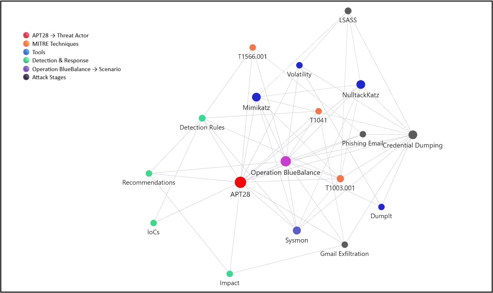

# APT28 Operation BlueBalance Investigation

This repository contains my investigation report and Obsidian Knowledge Graph created during the APT28 Operation BlueBalance scenario.

## Repository Contents

* Investigation Report (PDF)
* Obsidian Knowledge Graph
* MITRE ATT&CK Technique Mapping
* Detection Notes
* Indicators of Compromise (IoCs)

## About the Scenario

Operation BlueBalance is an APT28 emulation scenario that demonstrates a phishing attack followed by credential dumping and data exfiltration activities.

As part of this investigation, I reviewed the attack stages, examined the available evidence, analyzed Sysmon and memory analysis results, identified indicators of compromise, and mapped the observed activities to MITRE ATT&CK techniques.

## MITRE ATT&CK Techniques

* T1566.001 – Spearphishing Attachment
* T1003.001 – OS Credential Dumping: LSASS Memory
* T1041 – Exfiltration Over C2 Channel

## Author

Suad Abbas
